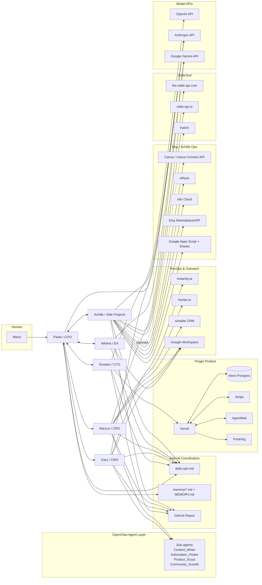

# PastaOS Infrastructure & Data Flow Map (Living Document)

Last updated: 2026-03-15 (PDT)  
Owner: COO (Pasta)  
Purpose: Single source of truth for services, integrations, costs, and data flows across Pinger, Canopy, Etsy ops, and OddsTool.

---

## 0) How to use this doc

- Treat this as the **canonical architecture map** for all agents.
- Before adding any new service, check this file first.
- Update this file when:
  - a new integration is added,
  - auth/secrets location changes,
  - data flow changes,
  - cost tier changes.
- Never place raw secrets here. Only reference secret locations.

---

## 1) System architecture (high-level)



---

## 2) Product-to-service matrix

- **Pinger:** Vercel, Neon Postgres, Stripe, AgentMail, PostHog, GitHub, Google Workspace, Airtable, Instantly, Hunter
- **Canopy (pre-build):** Airtable, Hunter, Google Workspace, Anthropic/Gemini/OpenAI (research + planning)
- **Etsy (ProPathCreations):** Canva, eRank, Etsy, Google Sheets/Apps Script, n8n (planned), GitHub
- **OddsTool:** the-odds-api.com, odds-api.io, Kalshi (planned), Google Sheets/Apps Script, GitHub
- **PastaOS cross-org operations:** OpenAI, Anthropic, Gemini, Google Workspace, Airtable, daily-ops + memory files

---

## 3) Internal operating flows (agent-to-agent + handoffs)

### 3.1 Coordination flow

```text
Mario -> Pasta (COO)
Pasta -> delegates to Einstein/Gary/Marcus/Athena/Achille
Agents -> write updates to /root/PastaOS/daily-ops.md and/or workspace memory files
Pasta -> consolidates blockers + next actions back to Mario
```

### 3.2 Cadence + automation references

- Daily standup cron: `/root/PastaOS/crons/daily-standup.md`
- Daily shared ops file: `/root/PastaOS/daily-ops.md`
- Agent memory continuity: `*/memory/YYYY-MM-DD.md` + role MEMORY.md files

### 3.3 Core anti-duplication rules

- Don’t add tools that duplicate current stack (CRM, outreach, hosting, analytics) without written replacement rationale.
- Reuse existing systems first: Airtable (CRM), Instantly (outreach), Vercel (hosting), Neon (DB), PostHog (analytics).
- If a new service is proposed, add a temporary “Proposed” entry in Section 4 before implementation.

---

## 4) External service registry (canonical)

> Cost values are best-known current estimates; mark unknowns for verification.

---

### 4.1 Instantly.ai
- **What it does:** Cold outreach campaign orchestration + warmup
- **Used by:** Gary (CMO), Marcus (CRO), Pasta (oversight)
- **Products:** Pinger (primary), Canopy (future)
- **Auth location (reference only):** Instantly web account credentials (owner-managed); any API keys should be referenced in `/root/PastaOS/.env` (if added)
- **Monthly cost:** Unknown in repo (verify exact plan)
- **Data in:** Leads/contact lists, email copy, sender mailboxes
- **Data out:** Campaign stats (opens/replies/bounces), sending activity
- **Connects to:** AgentMail inboxes/domains, Airtable CRM, manual review in daily-ops

### 4.2 AgentMail
- **What it does:** Transactional/support email send/receive for domains
- **Used by:** Einstein (implementation), Gary/Marcus (operations)
- **Products:** Pinger (active)
- **Auth location:** `products/pinger/.env` (`AGENTMAIL_API_KEY`, webhook secret)
- **Monthly cost:** $20/mo (Developer plan, from COO notes)
- **Data in:** App-generated support/reply messages, inbound customer emails, webhooks
- **Data out:** Delivered emails, inbox events, webhook payloads
- **Connects to:** Pinger app (Vercel), potentially CRM workflows

### 4.3 Hunter.io
- **What it does:** Prospect/contact discovery
- **Used by:** Marcus (CRO)
- **Products:** Pinger, Canopy (prospecting)
- **Auth location:** Expected in `/root/PastaOS/.env` (if key-based); otherwise account login
- **Monthly cost:** Free tier 25 searches/mo (noted)
- **Data in:** Company/domain search queries
- **Data out:** Emails, contact metadata/confidence
- **Connects to:** Airtable CRM import, outreach list prep

### 4.4 Airtable
- **What it does:** CRM + pipeline tracking (Pinger Prospects, Canopy Beta, Design Partners)
- **Used by:** Marcus (owner), Pasta (oversight), Gary (handoff)
- **Products:** Pinger, Canopy, Design Partner pipeline
- **Auth location:** Airtable account + API token/base IDs (reference in `/root/PastaOS/.env` when standardized)
- **Monthly cost:** Unknown in repo (verify workspace plan)
- **Data in:** Leads, stages, notes, activity logs
- **Data out:** Pipeline status, filtered prospect lists, handoff records
- **Connects to:** Instantly (campaign targeting), Hunter (enrichment), daily-ops reporting

### 4.5 Vercel
- **What it does:** Hosting/runtime for Pinger web app
- **Used by:** Einstein (CTO)
- **Products:** Pinger
- **Auth location:** Vercel project account + env vars (`products/pinger/.env.vercel.production` reference file exists)
- **Monthly cost:** Unknown in repo (verify actual plan)
- **Data in:** GitHub deployments, env variables, app traffic
- **Data out:** Running app endpoints, deployment logs, runtime metrics
- **Connects to:** Neon Postgres, Stripe, AgentMail, PostHog

### 4.6 Neon Postgres
- **What it does:** Primary relational database
- **Used by:** Einstein
- **Products:** Pinger
- **Auth location:** `products/pinger/.env` (`DATABASE_URL`)
- **Monthly cost:** Unknown in repo (verify tier)
- **Data in:** Application writes (users, monitors, billing state, etc.)
- **Data out:** Query results to app/API routes
- **Connects to:** Pinger (Vercel)

### 4.7 Stripe
- **What it does:** Billing, checkout, subscriptions, webhooks
- **Used by:** Einstein (integration), Pasta (revenue operations visibility)
- **Products:** Pinger
- **Auth location:** `products/pinger/.env` (`STRIPE_*`)
- **Monthly cost:** Usage-based processing fees
- **Data in:** Checkout/subscription events, payment methods, webhook events
- **Data out:** Payment status, subscription lifecycle, invoice/payment events
- **Connects to:** Pinger backend + Postgres state updates

### 4.8 PostHog
- **What it does:** Product analytics/event tracking
- **Used by:** Einstein (setup), Gary (growth analysis)
- **Products:** Pinger (active), Canopy (future)
- **Auth location:** Expected in product env vars (API key/project key; verify exact var names in implementation)
- **Monthly cost:** Unknown in repo (likely free/low tier initially)
- **Data in:** Frontend/backend event telemetry
- **Data out:** Funnels, retention, event dashboards
- **Connects to:** Pinger app and growth reporting workflows

### 4.9 Google Workspace (Gmail, Calendar, Tasks, Drive, Sheets, Docs, Contacts)
- **What it does:** Core business communication + docs + planning + sheets ops
- **Used by:** Athena (primary), Pasta, Gary, Marcus, Achille
- **Products:** All
- **Auth location:** Google account OAuth/logins; Sheets/App Script credentials in individual project setup docs
- **Monthly cost:** Unknown in repo (verify Workspace tier)
- **Data in:** Emails, calendars, docs, spreadsheet entries
- **Data out:** Briefings, schedules, sheet-based outputs, shared docs
- **Connects to:** Agent workflows, OddsTool sheets, Etsy template operations

### 4.10 Canva / Canva Connect API
- **What it does:** Listing image and design generation/editing pipeline
- **Used by:** Achille (primary), Mario (manual design operations)
- **Products:** Etsy operations
- **Auth location:** Canva account + Canva Connect API credentials (project-local configs; no central reference yet)
- **Monthly cost:** Canva Pro subscription (+ potential API tier constraints)
- **Data in:** Prompts/assets/screenshots/PPTX imports
- **Data out:** Exported PNG/JPG listing images and design assets
- **Connects to:** Etsy listing assets pipeline, local automation scripts

### 4.11 GitHub (incl. GitHub Actions)
- **What it does:** Source control + CI/CD + workflow automation
- **Used by:** All builders (Einstein, Gary, Marcus, Achille)
- **Products:** All
- **Auth location:** GitHub account/org auth + repo secrets (Actions secrets)
- **Monthly cost:** Unknown in repo (likely included/free at current usage)
- **Data in:** Code commits, workflow triggers, config changes
- **Data out:** Build artifacts, deployments, workflow logs/status
- **Connects to:** Vercel deploys, Apps Script deployment pipelines, n8n webhook triggers

### 4.12 the-odds-api.com
- **What it does:** Sportsbook odds feed
- **Used by:** Achille (OddsTool)
- **Products:** OddsTool
- **Auth location:** OddsTool Script Properties (`API_KEY_THE_ODDS_API`) in Google Apps Script
- **Monthly cost:** Unknown in repo (verify plan)
- **Data in:** Sport/bookmaker query parameters
- **Data out:** Event lines/odds snapshots
- **Connects to:** OddsTool calculation layer + Google Sheets presentation

### 4.13 odds-api.io
- **What it does:** Secondary odds feed (complement to the-odds-api)
- **Used by:** Achille
- **Products:** OddsTool
- **Auth location:** OddsTool Script Properties (`API_KEY_ODDS_API_IO`)
- **Monthly cost:** Unknown in repo (plan-limited; bookmaker cap noted)
- **Data in:** Event/bookmaker query parameters
- **Data out:** Odds snapshots by bookmaker/market
- **Connects to:** OddsTool normalization + low-hold calculations

### 4.14 Kalshi (planned integration)
- **What it does:** Prediction market execution target for EV+ automation
- **Used by:** Achille (planned)
- **Products:** OddsTool (Part B)
- **Auth location:** Not yet integrated; expected API credentials in secure env/script properties once implemented
- **Monthly cost:** N/A (trading/fees, no infra plan recorded)
- **Data in:** Candidate trades/signals
- **Data out:** Order status/positions/fills
- **Connects to:** Future OddsTool execution engine

### 4.15 eRank
- **What it does:** Etsy SEO research + keyword/competitor intelligence
- **Used by:** Achille (with Mario account dependency)
- **Products:** Etsy operations
- **Auth location:** eRank account login (Mario-owned)
- **Monthly cost:** Free tier currently noted
- **Data in:** Etsy niche/keyword queries
- **Data out:** Keyword trends/competition insights
- **Connects to:** Listing copy + tag optimization workflow

### 4.16 n8n Cloud
- **What it does:** Automation orchestrator for Etsy and related workflows
- **Used by:** Achille (planned/setup phase)
- **Products:** Etsy operations (and potentially cross-product automations)
- **Auth location:** URL documented (`pasta747.app.n8n.cloud`), credentials/API key owner-managed
- **Monthly cost:** Unknown in repo (verify n8n cloud tier)
- **Data in:** Webhook payloads/workflow triggers
- **Data out:** Automated task execution, downstream API calls, notifications
- **Connects to:** GitHub Actions webhooks, Etsy pipeline candidates, potentially Sheets/Canva/email flows

### 4.17 OpenAI API
- **What it does:** LLM inference (Einstein stack + GPT model tasks)
- **Used by:** Einstein (primary), potentially others via tooling
- **Products:** Pinger engineering + general ops
- **Auth location:** `/root/PastaOS/.env` (`OPENAI_API_KEY`)
- **Monthly cost:** Usage-based token spend
- **Data in:** Prompts/context/tool outputs
- **Data out:** Generated text/code/plans
- **Connects to:** OpenClaw agent runtime and task pipelines

### 4.18 Anthropic API
- **What it does:** LLM inference for Pasta/Gary/Marcus/Athena/Achille workflows
- **Used by:** Pasta, Gary, Marcus, Athena, Achille
- **Products:** All (ops, content, planning, execution)
- **Auth location:** `/root/PastaOS/.env` (`ANTHROPIC_API_KEY`)
- **Monthly cost:** Usage-based token spend (tracked in COO memory)
- **Data in:** Prompts/context/tool outputs
- **Data out:** Generated decisions/content/plans/code guidance
- **Connects to:** OpenClaw agent runtime

### 4.19 Google Gemini API
- **What it does:** LLM inference for Athena briefings and Product_Scout
- **Used by:** Athena, Marcus/Product_Scout, some Achille scripts
- **Products:** Ops + CRO research + ABF/Odds adjunct features
- **Auth location:** `/root/PastaOS/.env` (`GOOGLE_API_KEY`), plus some Apps Script `GEMINI_API_KEY` script properties
- **Monthly cost:** Usage-based
- **Data in:** Prompts/context
- **Data out:** Briefings, research synthesis, generated outputs
- **Connects to:** OpenClaw agents and Apps Script integrations

### 4.20 Etsy Marketplace / Etsy API (operationally relevant; partially integrated)
- **What it does:** Sales channel for digital products; API for listing automation (future)
- **Used by:** Mario + Achille
- **Products:** Etsy shop (ProPathCreations)
- **Auth location:** Etsy account login; Etsy API key not yet provisioned in repo
- **Monthly cost:** Listing + transaction/payment fees (platform fees)
- **Data in:** Listings/assets/product metadata
- **Data out:** Orders/reviews/traffic/sales analytics
- **Connects to:** Canva assets, Google Sheets deliverables, eRank SEO inputs

---

## 5) Critical end-to-end data flows

### 5.1 Pinger customer + billing flow

```text
Visitor -> Pinger (Vercel)
Pinger -> Stripe checkout/subscription APIs
Stripe webhook -> Pinger backend -> Neon Postgres
Pinger -> AgentMail for support/transactional emails
Pinger -> PostHog events for product analytics
Ops visibility -> daily-ops.md + Airtable CRM (for pipeline/customer context)
```

### 5.2 Outreach + CRM flow

```text
Hunter.io leads -> Airtable (prospect records)
Airtable segments -> Instantly campaigns
Instantly sending via configured sender inbox/domain
Replies/conversions -> Airtable stage updates
COO summary -> daily-ops.md -> Mario unblock decisions
```

### 5.3 Etsy listing production flow

```text
Product concept -> Google Sheets template build (Apps Script)
Screenshots/assets -> Canva mockup generation
SEO research -> eRank keywords/tags
Listing package -> Etsy listing draft/publish (manual today)
(optional) n8n automates repetitive steps as pipeline matures
```

### 5.4 OddsTool analysis flow

```text
the-odds-api + odds-api.io -> OddsFetcher normalization
Normalization -> low-hold/edge calculations in script logic
Outputs -> Google Sheets views/trackers
(planned) signals -> Kalshi execution module -> positions/orders
```

### 5.5 Internal operating flow

```text
Mario priorities -> Pasta
Pasta delegation -> C-suite + Achille
Agent updates -> memory files + daily-ops.md
Pasta consolidation -> prioritized unblock list back to Mario
```

---

## 6) Auth/secrets map (reference-only, no secrets)

- Root shared model keys: `/root/PastaOS/.env` (+ `.env.example` template)
- Pinger app secrets: `/root/PastaOS/products/pinger/.env` and Vercel project envs
- GitHub CI secrets: repository/org Actions secrets
- Google Apps Script secrets (OddsTool/other scripts): Script Properties
- Service dashboard logins (Instantly, Airtable, eRank, n8n, Canva, Etsy): owner-managed accounts

**Rule:** when adding a new service, add:
1) secret variable naming convention, and  
2) exact config location path in this section.

---

## 7) Gaps / TODOs to keep this accurate

1. Verify exact monthly plans/costs for: Instantly, Airtable, Vercel, Neon, PostHog, n8n, odds APIs, Google Workspace.
2. Standardize non-LLM service keys into one documented env convention (or service-specific env files) and update Section 6.
3. Add unique service owner field (DRI) per integration.
4. Add status tags per service: `active | setup | planned | deprecated`.
5. Confirm whether Kalshi is already present as read-only source in odds-api.io data and separate from direct Kalshi trading API integration.

---

## 8) Change log

- **2026-03-15:** Initial top-level infrastructure map created at `/root/PastaOS/INFRASTRUCTURE.md` with:
  - architecture diagram,
  - product/service mapping,
  - service registry (20 entries),
  - internal and external data flows,
  - auth reference map,
  - maintenance TODOs.
